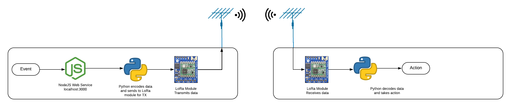

# Raspberry Pi LoRa Service

Designed for use with the Adafruit RFM9X LoRa breakout board.

This repository provides scripts/services for a pi acting as a LoRa transmitter, and a LoRa receiver. 





## TX

The service provided for the pi configured to transmit data over LoRa has a local web service running on port `3000`. 

The local web service allows API calls to be made from other programs/services/scripts on the Pi, which are then forwarded to the other raspberry pi (RX) over LoRa.

## RX 

The service provided for the pi configured to receive data over LoRa is a python script that listens and receives packets from the RFM9X module. The `receive-lora.py` script can be modified to take other actions based on the data received.

## Preliminary Setup

### Python

These libraries/modules use Python 3, so be sure `python3` and `pip3` both work.

### Update the Pi

  `sudo apt-get update`  
  `sudo apt-get upgrade`  

### Upgrade Setup Tools  

  `sudo pip3 install --upgrade setuptools`

  (`sudo apt-get install python3-pip` if the above does not work)

### Enable SPI  

  Run `raspi-config` and under `Interfacing Options` --> `Advanced Options` enable the SPI interface then reboot the pi

### Install Python libraries

  `pip3 install RPI.GPIO`  
  `pip3 install adafruit-circuitpython-rfm9x`


## Wiring Configuration  


## Check RFM9X connection

  Run the `rfm9x-check` script in the `scripts/` directory:

  `python3 scripts/rfm9x-check.py`

  If everything is setup correctly, you should see the following output  

  ```
  RFM9x: Detected
  RFM9x: Detected
  RFM9x: Detected
  RFM9x: Detected
  RFM9x: Detected
  RFM9x: Detected
  RFM9x: Detected
  RFM9x: Detected
  RFM9x: Detected
  RFM9x: Detected
  ```

  If you see `RFM9x: ERROR` check your connections.  

## Installing the LoRa scripts/services  

### TX  

To install/configure the services on the pi used to transmit data:  

`sudo make install`  

### RX 

To install/configure the services on the pi used to receive data:  

`sudo make install.rec`

## Unstalling the LoRa scripts/services  

### TX  

To uninstall the services on the pi used to transmit data:  

`sudo make uninstall`  

### RX 

To uninstall the services on the pi used to receive data:  

`sudo make uninstall.rec`


## References  

`https://learn.adafruit.com/circuitpython-on-raspberrypi-linux/installing-circuitpython-on-raspberry-pi`
`https://learn.adafruit.com/lora-and-lorawan-radio-for-raspberry-pi/rfm9x-raspberry-pi-setup`